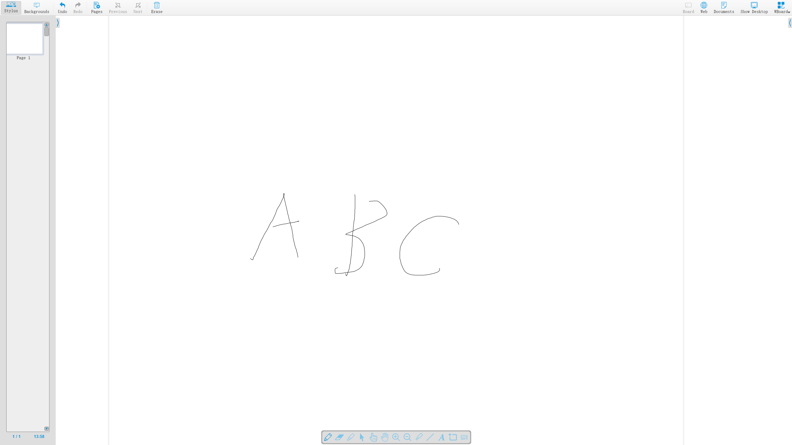
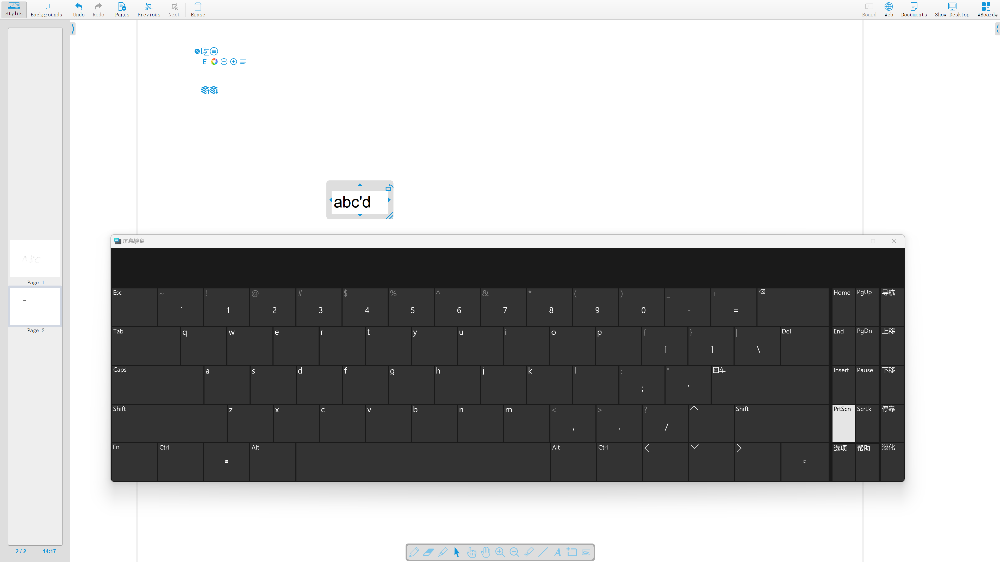
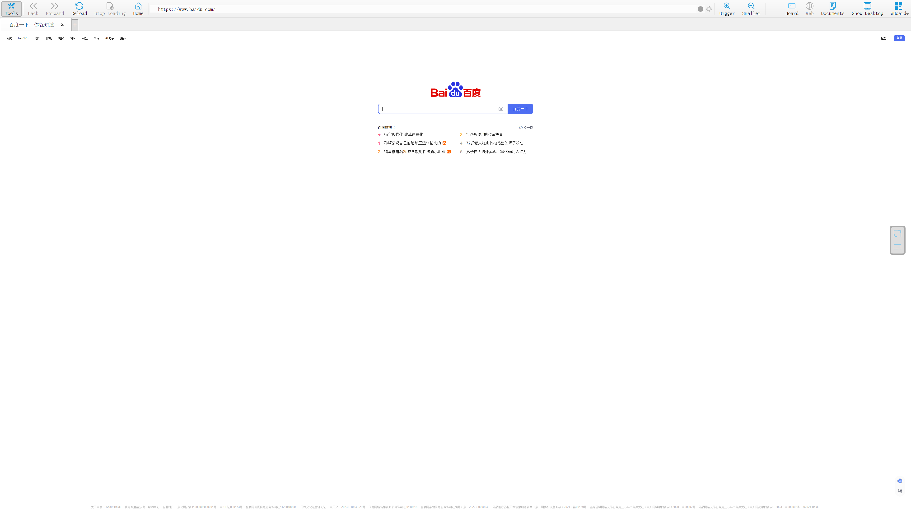
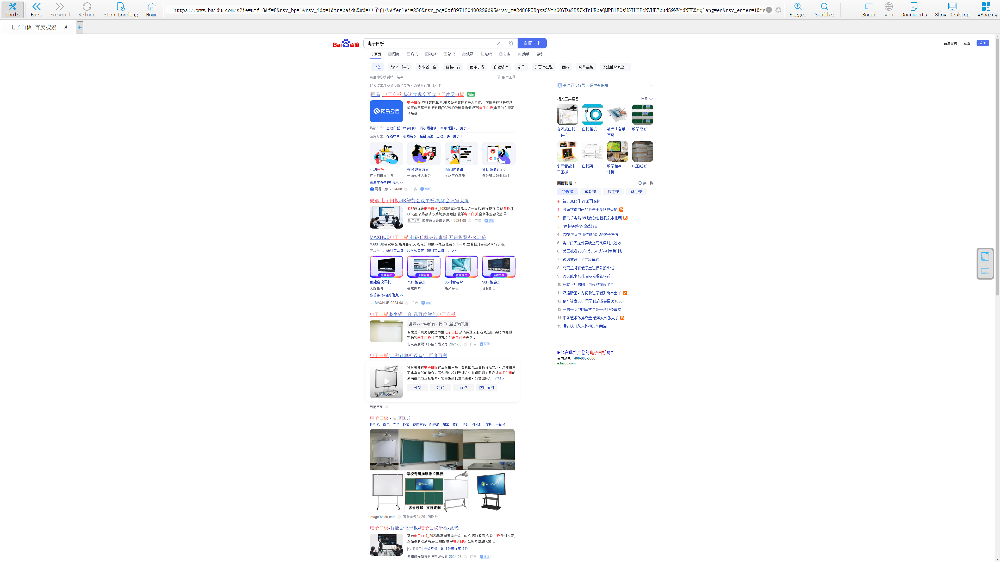
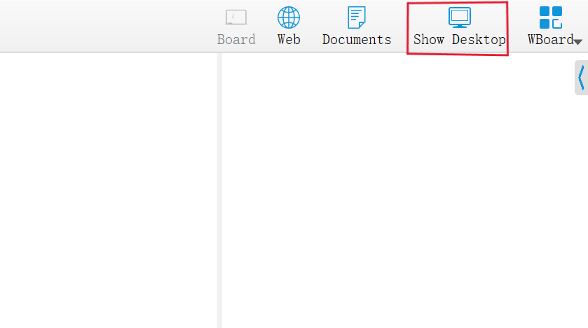

# WBoard
WBoard是一款在Windows平台基于VS+Qt开发的一款开放源码的白板教学软件，主要用于学校和大学的交互式电子白板。 它既
可以与交互式白板一起使用，也可以在双屏幕场景中通过笔、平板显示器和光束进行使用。 主要有演示板、网页、文档和桌面四大界
面。
## 编译环境
**Visual Studio**: VS2017及以上 

**Qt**: Qt5.15.2
## 项目运行截图
### 演示板
光标绘画

屏幕键盘文本输入

### 网页
网页浏览

### 桌面
返回桌面按键，方便教师切换。
